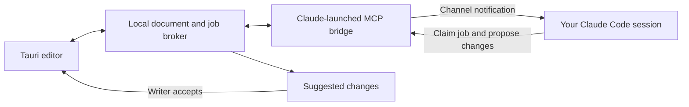

# Notebook Duplex

A local Tauri Markdown editor that collaborates with a Claude Code session you launch yourself.

Write in the document while Claude processes inline commands. Review suggestions before they change your text. The interface follows Datadog notebook layouts and public DRUIDS typography and color tokens.

## Run the editor

Requires Node.js 24, Rust, and the [Tauri prerequisites](https://v2.tauri.app/start/prerequisites/).

```sh
git clone git@github.com:andyjmorgan/notebook-duplex.git
cd notebook-duplex
npm ci
npm start
```

The launcher starts the local broker and Tauri development shell. Keep its terminal open.

For a browser preview, run `npm run broker` in one terminal and `npm run dev` in another, then open http://127.0.0.1:5173. The browser preview is optional.

## Personal Claude demo

Install and authenticate [Claude Code](https://code.claude.com/docs/en/setup) using a personal Pro or Max account.

This checkout provides a separate personal profile under `.personal-claude/`. It is ignored by Git. The launcher registers the MCP bridge in that profile, runs Claude in this repository, and clears inherited provider credentials and provider-selection variables for that child process. It leaves managed settings and restriction controls in effect.

Keep the editor running. In another terminal, from this checkout:

```sh
npm run claude:personal -- --login
```

Complete the sign-in yourself using your personal claude.ai account. Then launch the channel-enabled session:

```sh
npm run claude:personal
```

Accept Claude's custom development-channel warning and initial trust prompts. The development-channel flag permits this locally developed channel; it does not skip normal tool permissions.

In Notebook Duplex, choose “Personal demo” under Claude session. Select a plain-text paragraph and submit:

```text
Suggest a clearer version of this paragraph. Preserve its meaning.
```

Claude should claim the job and submit a proposed replacement. Keep typing in a different paragraph while it works. Accept or reject the suggestion in the right margin.

The launcher supports `--continue` or other Claude session arguments:

```sh
npm run claude:personal -- --continue
```

The personal configuration directory does not remove system-wide managed policies. If this personal session reports that channels are blocked, run `/status` to inspect its setting sources. Use an approved personal environment for the demo or request policy approval. Do not move company code or documents into the personal demo.

References: [multiple Claude accounts](https://code.claude.com/docs/en/authentication#log-in-with-multiple-accounts), [channel contract](https://code.claude.com/docs/en/channels-reference), and [managed settings](https://code.claude.com/docs/en/settings).

## Connect another existing Claude environment

Start the editor first. In your chosen repository, register this bridge using the absolute path to this checkout:

```sh
claude mcp add --transport stdio --scope local notebook-duplex -- node "/absolute/path/to/notebook-duplex/agent/bridge.mjs"
claude --dangerously-load-development-channels server:notebook-duplex
```

For an existing conversation, add `--continue` or `--resume` to the launch command. A session must restart with channel support enabled. Organization policy must permit channels.

The bridge displays Claude's working directory in the editor. Multiple sessions can connect; select the intended session before submitting commands. An optional `MARGIN_SESSION_NAME` environment variable supplies a display name.

## Demo walkthrough

1. Start the editor and a channel-enabled personal Claude session.
2. Import `examples/demo.md`, or use the starter document.
3. Select a plain-text paragraph, choose Ask agent, and request a clearer version.
4. Edit another paragraph while Claude works, then accept the suggestion.
5. Request another suggestion and edit its target paragraph before accepting. The old suggestion becomes stale.
6. Use Undo after an accepted suggestion.
7. Add a table with `/table`, then use its row and column controls.
8. Select a `[tk: ...]` paragraph and choose Run directive.
9. Optionally enable experimental proofreading.

Use “Try a local test suggestion” to exercise approval without a Claude connection. That fixture does not call a model and must not be presented as an agent result.

## Features

- rich text formatting and basic Markdown import/export
- GFM text tables with row, column, and header controls
- stable document node IDs and an automatic outline
- Editing and Viewing modes
- slash insertion menu and explicit agent command submission
- named Claude sessions connected through an MCP channel bridge
- persisted jobs, snapshots, and reviewable proposals
- accept, reject, locate, stale detection, and undo
- experimental proofreading with obsolete-job invalidation

## How it works



Tiptap JSON is the canonical document. Markdown is an export. The broker checks target identity and revision at acceptance. Unrelated writing remains intact, while changed or deleted targets invalidate old proposals.

The MCP surface exposes job claiming, snapshots, proposals, and status reporting. It does not expose an acceptance tool.

Local broker requests require a random bearer token. Bridge sessions also have individual secrets. The broker binds to loopback and checks browser origins. Runtime documents and credentials live in `.runtime/`, which is ignored by Git.

The local protocol is not a boundary against processes with unrestricted access to this checkout. Strict approval isolation also requires harness restrictions on direct writes to runtime state and managed document files.

## Visual references

The UI uses independent components inspired by the public [DRUIDS typography guide](https://druids.datadoghq.com/foundations/typography), its published CSS tokens, and official [Datadog notebook screenshots](https://www.datadoghq.com/blog/collaborative-notebooks-datadog/). Noto Sans and Roboto Mono are bundled locally. It does not import Datadog's internal DRUIDS library.

## Prototype limits

- one persistent document
- proposals replace a single plain-text paragraph or heading; formatted ranges and structural table proposals are refused
- no CRDT, simultaneous writers, production packaging, or native file dialogs
- initial trust and tool permission prompts remain in Claude's terminal; permission relay is not implemented
- cancellation invalidates late results but does not interrupt Claude's agent loop
- queued channel notifications require explicit job claiming for acknowledgement
- reconnects can replay notifications; arbitrary external actions do not have exactly-once guarantees
- restarting Claude creates a new session identity; old jobs remain visible but require cancellation and resubmission
- stale suggestions require a new command
- Markdown import may normalize source; Obsidian syntax, frontmatter, rich HTML, and external-file merging are not certified
- background proofreading shares Claude's task queue and can be delayed by longer commands
- the desktop shell reads the broker connection descriptor from its source checkout

## Verification

```sh
npm test
npm run build
cargo check --manifest-path src-tauri/Cargo.toml --features custom-protocol
```

Automated tests exercise channel notifications with a mock MCP client, safe proposal approval, session ownership, immutable snapshots, concurrent edits, cancellation, stale targets, editor rendering, undo, viewing mode, slash-table insertion, and personal-profile isolation.

The web build and Rust compile checks are verified. Actual personal-account authentication and end-to-end Claude model responses require the interactive demo.
