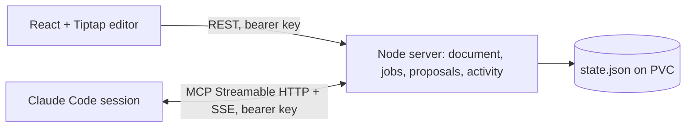

# Notebook Duplex

A hosted Markdown notebook library where you write and a Claude Code session works beside you. You ask from the keyboard, keep typing, and Claude's suggestions arrive inline as reviewable diffs. Nothing changes until you accept it.

Live at **https://notebook.donkeywork.dev** (office cluster). Sign in with the lab's Keycloak account; Claude sessions connect with a personal access token. The design and API contract for the library, identity and storage is in [`docs/library.md`](docs/library.md).

## Sign in

The web app signs in with OpenID Connect (Authorization Code + PKCE, `oidc-client-ts`) against the realm and client that `GET /api/config` reports. Tokens live in `localStorage`; the access token is renewed silently with the refresh token a minute before it expires, and a `401` from the API triggers one silent renew and a retry before sending you back through sign-in with your place kept. If the session is lost while you type, pending edits are flushed first. The avatar at the top right opens the user menu: name and email, the theme toggle (system / light / dark), **Agent access tokens**, and sign out.

For local development without Keycloak, start the server with `AUTH_DEV_USER=you@example.com`; `/api/config` then carries `devUser`, the app skips OIDC and sends requests without an `Authorization` header.

## The library

Every document lives in one shared library. The left column is the library itself:

- **Search** with live results as you type (Postgres full text with highlighted snippets); arrow keys and Enter open a result, Enter on the box opens `/search?q=` with everything.
- **Folder tree** with documents under folders and counts. Folders remember whether you closed them; the current document's folder is always open. Right-click or the row menu offers rename, move to folder, and delete (with Undo in the toast). Folders offer new document, new folder and delete when empty.
- **Tags** as a cloud with counts; click one for `/tags/:tag`.
- **New document** and **New folder**. The first document in an empty library opens with a short tour; later ones start blank.
- Below it, the current document's **outline** (collapsible) and the read-aloud player.

The document header has the editable title, a breadcrumb of the folder (click to move), tag chips (type to add, Enter or comma commits, Backspace removes, suggestions from existing tags) and a **Properties** disclosure with the full front matter as YAML. Saving it writes `frontmatter`; title, tags and folder are derived from it, unknown keys are kept verbatim. Known keys: `title`, `tags`, `folder`, `aliases`, `created`, `updated`.

Type `[[Title]]` to link another document; it renders as a link once the title resolves (⌘-click to follow while editing, plain click in Reading mode). The end of the document lists **Related** documents (shared tags) and **Linked from** (backlinks). Routes: `/` opens the last document you had open (else the first), `/d/:id`, `/tags/:tag`, `/search?q=`, `/settings/tokens`.

Switching documents flushes any pending save, stops read-aloud, drops held requests and loads the new document's jobs, proposals and activity; everything in the rail is scoped to the document you are looking at. **Import .md** creates a new document (front matter in the file wins over the file name); **Export** downloads the server's Markdown with front matter.

## How it feels

- **Ask without leaving the paragraph.** `⌘K` (or `/agent` + Space) opens an inline command bar under the paragraph you're in. `Enter` sends, `Esc` returns you to writing. Scope is the current paragraph or the whole document.
- **Suggestions land where they apply.** A replace suggestion renders as a fenced diff under its paragraph: removed words struck through in red, added words in green. An insert suggestion renders as an editable Markdown block at the anchor. Both offer **Accept**, **Reject**, and **Reconsider…**, which sends your note back to Claude as a follow-up job.
- **Edit before you accept.** Insert proposals are editable in place. Replace proposals have an **Edit** mode. Accepting an edited suggestion records your final text.
- **See where Claude is working.** Claude marks the blocks it is reading, thinking about, or writing. The paragraph gets a breathing gutter bar that fills with progress and a small pill naming the session and its message. Queued requests show a dashed bar. The right rail shows the same with a progress line.
- **Inline directives.** Type `[tk: find a source for this]` anywhere. The note renders as a chip while you type and fires the moment you close the bracket, so you keep writing while Claude works. The chip shows queued, working and done states in place; Claude's proposal removes the directive when you accept it.
- **Comments, not just edits.** When Claude has something to say but nothing to change (an answer, a caveat, a question back), it leaves a Markdown comment on the section. Resolve it, or Reply and the thread continues as a follow-up job.
- **Preview before you accept.** Insert cards open on a rendered preview with an Edit tab for the Markdown. Edit cards switch between Diff, Preview and Edit. Formatted paragraphs (bold, italic, links, code) are replaceable: the agent reads and writes inline Markdown and formatting survives. An empty replacement removes the block.
- **Right-click menu.** Ask the agent about the highlighted text (the selection travels with the request), proofread the paragraph or table under the caret, format, insert a table, cut, copy and paste.
- **Nothing hides off-screen.** Floating pills at the top and bottom of the page count suggestions and working agents outside the viewport and scroll you to the nearest one.
- **Keyboard review.** With the caret in a paragraph that has a suggestion, `⌘↵` accepts it. `⌘Z` undoes any accepted change.
- **Read aloud.** The player under the word count (bottom left) reads the document with Kokoro TTS and highlights each utterance in amber as it plays: sentences inline; images, diagrams, tables and table rows as blocks. Headings are their own utterance, images read as "An image of {alt}", a table is announced ("A table with 2 columns and 2 rows.") and then read row by row with the column titles ("Idea: Write freely. Next step: …"), and a Mermaid fence is read as "A chart or diagram showing …" with a two-sentence explanation from the lab LLM (code blocks get a short summary). `[tk: …]` notes and suggestion cards are skipped. Controls: Play/Pause, Stop, speed (0.75×, 1×, 1.3×, 1.5×, applied as `playbackRate` so switching is instant), position and a progress bar. Right-click gives **Read from here** and **Stop reading**; it works in Reading mode too. Audio is requested a few utterances ahead and cached for the session; any edit empties the recording. While Claude is working on the page the player is disabled, and while you listen the agent is paused: asks you make are held in the rail and sent in order when you stop; proofreading, `[tk]` firing and Accept/Reject wait.
- **Stale protection.** If you rewrite a paragraph after a suggestion was written, the suggestion is marked as changed and cannot be applied. Writing anywhere else leaves it alive.
- Rich text formatting, GFM tables with row and column controls, images, Mermaid diagrams (a ```mermaid fence shows as a diagram with a Source tab and an expand button; the source opens when the caret enters the block). Tune a diagram with Mermaid front matter, or the theme, look and layout pickers in its header, which write that front matter for you:

  ```mermaid
  ---
  config:
    theme: forest
    look: handDrawn
    layout: tidy-tree
  ---
  mindmap
    root((Notebook))
      Writer
      Claude
  ```

  Themes: `default`, `neutral`, `forest`, `dark`, `base` (with `themeVariables`). Looks: `classic`, `handDrawn`, `neo`. Layouts: `dagre` or `elk` for flowcharts, state, class and ER diagrams; `cose` or `tidy-tree` for mindmaps. Any other Mermaid `config` key works too, slash insert menu, outline, Reading mode, Markdown import and export. Background proofreading treats a table as one unit rather than cell by cell.

## Connect a Claude session

Claude Code channels only run as a local stdio process that Claude spawns, so the connection goes through a small shim, `agent/channel.mjs`, which proxies tools to the hosted server over MCP Streamable HTTP and forwards channel notifications back. Create a personal access token under **Agent access tokens** in the user menu (`/settings/tokens`): it is shown once, stored hashed, and every job records which account asked. Clone this repo once and `npm ci`, then register the shim (user scope makes it available from every repository):

```sh
claude mcp add --transport stdio --scope user notebook-duplex -- \
  node /path/to/notebook-duplex/agent/channel.mjs --url https://notebook.donkeywork.dev --token ndp_…
claude --dangerously-load-development-channels server:notebook-duplex
```

The tokens page shows this command ready to paste with your new token; the rail's **Connect a Claude session** panel links there. Revoking a token disconnects anything using it. Accept the development-channel warning and the usual trust prompts in Claude's terminal. The shim names the session after the directory Claude runs in and reports that path, so you can tell sessions apart in the editor. `--name` overrides it; `NOTEBOOK_DUPLEX_URL`, `NOTEBOOK_DUPLEX_KEY` and `NOTEBOOK_DUPLEX_NAME` work as environment variables too.

Multiple sessions can connect at once. Each job is addressed to one session. Restarting Claude creates a new session; cancel and resubmit anything it was holding. If you are on the lab LAN, the hostname must resolve to office1 rather than the public IP (the EdgeRouter has a static host mapping for this), or TLS will present the router's certificate.

## Agent tools

Claude receives each command as a `notifications/claude/channel` event over the MCP SSE stream and works through these tools:

| Tool | Purpose |
| --- | --- |
| `identify_session` | Name the session and report its working directory |
| `list_jobs` | Queued and running jobs for this session, in case a notification was missed |
| `claim_job` | Acknowledge a job and read the scoped blocks plus two neighbours (whole tables included), with revisions and any reconsideration or reply context; `full: true` for everything. Adopts jobs orphaned by a restart |
| `get_blocks` | Read specific snapshot blocks by ID |
| `get_document_snapshot` | The whole snapshot or live document, including JSON. Large; use sparingly |
| `set_block_status` | Mark blocks as `reading`, `thinking`, `writing`, `waiting` or `done`, with optional progress and message |
| `propose_changes` | `replace` a paragraph, heading or table (inline or GFM Markdown in and out), `delete` a block, `move` a contiguous run of top-level blocks, `insert` Markdown before or after an anchor, `replace_text` to find and replace across the document as one batch, or `comment` on a block |
| `report_job_status` | `running`, `completed`, `failed` or `needs_permission`; returns a small status record. A completed job still accepts proposals for two minutes |

There is no accept tool. The server verifies every proposal against the job snapshot, and acceptance checks the target's revision again at review time.

## Architecture



- One Node process serves the built app, the `/api` routes, and the MCP endpoint at `/mcp`. Tiptap JSON is the canonical document; Markdown is import and export.
- Stable block IDs and content hashes identify proposal targets. Job snapshots are immutable. Accepting applies the change on the server, mirrors it in the editor as one undoable transaction, and syncs.
- Hosted behind Traefik on the office cluster with an **unproxied** DNS record. Cloudflare's proxy closes idle SSE streams after 100 seconds, so the hostname is DNS-only and traffic reaches the lab's static IP directly. Cluster manifests live in the lab GitOps repo under `clusters/office/applications/notebook-duplex/`.

## Theming

The app uses the DonkeyWork design tokens as CSS custom properties in `src/style.css`: a light set on `:root` and a dark set under `.dark` on `<html>` (backgrounds, borders, text, cyan accent, success/warning/error, a cyan→blue gradient for primary buttons). The legacy `--ui-*` names map onto them; purple (`--ui-brand`) is kept for agent suggestions and indigo (`--ui-ai`) for agent activity, because those identify Claude, and amber stays for read-aloud. Fonts are Inter and JetBrains Mono (`@fontsource`), icons come from `lucide-react`, toasts from `sonner`. The theme choice (system, light, dark) is in the user menu and persisted in `localStorage`; Mermaid diagrams without an explicit theme follow it.

## Run locally

Requires Node.js 24.

```sh
npm ci
AUTH_DEV_USER=you@example.com npm run server   # http://127.0.0.1:8787; see docs/library.md for DATABASE_URL and S3_* settings
npm run dev                                    # Vite on http://127.0.0.1:5173, proxies /api and /mcp
```

Against the cluster's Keycloak, set `OIDC_ISSUER`, `OIDC_JWKS_URL`, `OIDC_CLIENT_ID` and `OIDC_AUTHORITY_PUBLIC` instead (see the contract). For a production-like run, `npm run build` then open the server URL directly. The container image (`Dockerfile`) is built on the lab's self-hosted runners and pushed to the internal Nexus registry (`192.168.0.140:5555/notebook-duplex`) by the `Container image` workflow on every push to `main`.

Environment: `PORT` (8787), `HOST` (127.0.0.1), `DATA_DIR` (`.runtime`), `PUBLIC_URL` (used for the MCP URL shown in the UI), `SESSION_GRACE_MS` (how long a session survives without its SSE stream, 20000).

Read-aloud (the browser cannot reach the lab LAN, so the server proxies both behind the same sign-in): `KOKORO_URL` (`http://kokoro-tts.kokoro-tts.svc.cluster.local:8000`, OpenAI-style `POST /v1/audio/speech` returning WAV), `KOKORO_FALLBACK_URL` (`http://192.168.69.28:30882`, the GPU instance on the Spark, tried when the first is unreachable; set empty to disable), `KOKORO_VOICE` (`af_heart`), `DESCRIBE_LLM_URL` (`http://192.168.69.28:11434`, OpenAI-compatible `/v1/chat/completions`, reasoning off), `DESCRIBE_LLM_MODEL` (`gemma4:26b`), `DESCRIBE_LLM_TIMEOUT_MS` (20000). Descriptions are cached in memory by content hash; if the model is unreachable the server falls back to a deterministic description ("a flowchart with 4 nodes: A, B, C, D"). Endpoints: `POST /api/tts {text, speed}` → `audio/wav`, `POST /api/describe {kind, source, language}` → `{text}`.

## Verification

```sh
npm test          # store, diff, narration, read-aloud proxy and server tests, including a real MCP client over Streamable HTTP
npm run build     # type-check and web build
npm run test:e2e  # Playwright: browser + MCP agent end to end (needs: npx playwright install chromium)
```

The end-to-end tests run headless Chromium against the built app. `e2e/library.test.mjs` drives the library UI against an in-memory implementation of the API contract (`e2e/mock-api.mjs`, which reuses the server's `Store` per document): dev-mode sign-in, `/` redirect, the folder tree, document switching with flush, wikilinks, related and backlinks, tag chips and tag pages, live search and the search page, title and properties (YAML) edits, move, new/rename/delete with undo, the local fixture through the per-document routes, import and export, agent access tokens, and the theme toggle in both light and dark. `e2e/notebook.test.mjs` and `e2e/readaloud.test.mjs` still start the pre-library server and reach it through `e2e/legacy-shim.mjs`, which maps `/api/d/:id/*` onto the old routes; once the server implements the contract, run them with `AUTH_DEV_USER` and delete the shim. They cover inline replace and insert proposals, editing before accept, stale detection, a remote MCP session receiving channel notifications, margin status rendering, reconsider round-trips, keyboard accept, undo, slash menu, Reading mode, and read-aloud (with `/api/tts` and `/api/describe` intercepted in the browser): highlight order across sentences, tables, images and diagrams, pause and resume, Read from here, held asks, the Claude-active lock, and edits emptying the recording.

## Limits

- One shared library per deployment; anyone who can sign in can read and edit every document. Single writer per document: no CRDT or simultaneous editing.
- Replace proposals cover paragraphs, headings and tables. Code blocks and diagrams can be inserted but not rewritten in place yet.
- Tool permission and trust prompts stay in Claude's terminal. Channels are a Claude Code research preview and need the development-channel flag; organisation policy can disable them.
- Cancelling a job invalidates late results but does not interrupt Claude's loop. The blocks you point at are the agent's focus, not a boundary: for commands it may change other blocks when the request needs it (moving content into a table, renaming a term everywhere). Automatic proofreading stays inside its scope. After a server restart, a reconnecting session with the same name inherits the previous session's open jobs.
- Markdown import may normalise source. Obsidian syntax, frontmatter and raw HTML are not certified to round-trip.
- An agent access token grants the same access as the account that minted it. Revoke it from **Agent access tokens** if it leaks.
