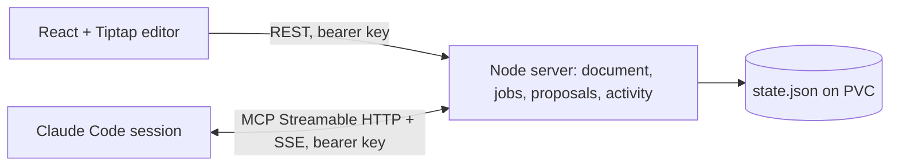

# Notebook Duplex

A hosted Markdown notebook where you write and a Claude Code session works beside you. You ask from the keyboard, keep typing, and Claude's suggestions arrive inline as reviewable diffs. Nothing changes until you accept it.

Live at **https://notebook.donkeywork.dev** (office cluster). Protected by a single notebook key.

## How it feels

- **Ask without leaving the paragraph.** `⌘K` (or `/agent` + Space) opens an inline command bar under the paragraph you're in. `Enter` sends, `Esc` returns you to writing. Scope is the current paragraph or the whole document.
- **Suggestions land where they apply.** A replace suggestion renders as a fenced diff under its paragraph: removed words struck through in red, added words in green. An insert suggestion renders as an editable Markdown block at the anchor. Both offer **Accept**, **Reject**, and **Reconsider…**, which sends your note back to Claude as a follow-up job.
- **Edit before you accept.** Insert proposals are editable in place. Replace proposals have an **Edit** mode. Accepting an edited suggestion records your final text.
- **See where Claude is working.** Claude marks the blocks it is reading, thinking about, or writing. The paragraph gets a breathing gutter bar that fills with progress and a small pill naming the session and its message. Queued requests show a dashed bar. The right rail shows the same with a progress line.
- **Inline directives.** Type `[tk: find a source for this]` anywhere. The note renders as a chip while you type and fires the moment you close the bracket, so you keep writing while Claude works. The chip shows queued, working and done states in place; Claude's proposal removes the directive when you accept it.
- **Right-click menu.** Ask the agent about the highlighted text (the selection travels with the request), proofread the paragraph or table under the caret, format, insert a table, cut, copy and paste.
- **Nothing hides off-screen.** Floating pills at the top and bottom of the page count suggestions and working agents outside the viewport and scroll you to the nearest one.
- **Keyboard review.** With the caret in a paragraph that has a suggestion, `⌘↵` accepts it. `⌘Z` undoes any accepted change.
- **Stale protection.** If you rewrite a paragraph after a suggestion was written, the suggestion is marked as changed and cannot be applied. Writing anywhere else leaves it alive.
- Rich text formatting, GFM tables with row and column controls, images, slash insert menu, outline, Reading mode, Markdown import and export. Background proofreading treats a table as one unit rather than cell by cell.

## Connect a Claude session

Claude Code channels only run as a local stdio process that Claude spawns, so the connection goes through a small shim, `agent/channel.mjs`, which proxies tools to the hosted server over MCP Streamable HTTP and forwards channel notifications back. Clone this repo once and `npm ci`, then register the shim (user scope makes it available from every repository):

```sh
claude mcp add --transport stdio --scope user notebook-duplex -- \
  node /path/to/notebook-duplex/agent/channel.mjs --url https://notebook.donkeywork.dev --key <notebook key>
claude --dangerously-load-development-channels server:notebook-duplex
```

The rail's **Connect a Claude session** panel copies these commands with your key filled in. Accept the development-channel warning and the usual trust prompts in Claude's terminal. The shim names the session after the directory Claude runs in and reports that path, so you can tell sessions apart in the editor. `--name` overrides it; `NOTEBOOK_DUPLEX_URL`, `NOTEBOOK_DUPLEX_KEY` and `NOTEBOOK_DUPLEX_NAME` work as environment variables too.

Multiple sessions can connect at once. Each job is addressed to one session. Restarting Claude creates a new session; cancel and resubmit anything it was holding. If you are on the lab LAN, the hostname must resolve to office1 rather than the public IP (the EdgeRouter has a static host mapping for this), or TLS will present the router's certificate.

## Agent tools

Claude receives each command as a `notifications/claude/channel` event over the MCP SSE stream and works through these tools:

| Tool | Purpose |
| --- | --- |
| `identify_session` | Name the session and report its working directory |
| `list_jobs` | Queued and running jobs for this session, in case a notification was missed |
| `claim_job` | Acknowledge a job and read its immutable snapshot (block IDs, text, revisions, any reconsideration note) |
| `get_document_snapshot` | Re-read a job snapshot or the live document |
| `set_block_status` | Mark blocks as `reading`, `thinking`, `writing`, `waiting` or `done`, with optional progress and message |
| `propose_changes` | `replace` one plain-text paragraph or heading, or `insert` Markdown before or after an anchor block |
| `report_job_status` | `running`, `completed`, `failed` or `needs_permission` |

There is no accept tool. The server verifies every proposal against the job snapshot, and acceptance checks the target's revision again at review time.

## Architecture



- One Node process serves the built app, the `/api` routes, and the MCP endpoint at `/mcp`. Tiptap JSON is the canonical document; Markdown is import and export.
- Stable block IDs and content hashes identify proposal targets. Job snapshots are immutable. Accepting applies the change on the server, mirrors it in the editor as one undoable transaction, and syncs.
- Hosted behind Traefik on the office cluster with an **unproxied** DNS record. Cloudflare's proxy closes idle SSE streams after 100 seconds, so the hostname is DNS-only and traffic reaches the lab's static IP directly. Cluster manifests live in the lab GitOps repo under `clusters/office/applications/notebook-duplex/`.

## Run locally

Requires Node.js 24.

```sh
npm ci
NOTEBOOK_API_KEY=devkey npm run server     # http://127.0.0.1:8787, data in .runtime/
npm run dev                                # Vite on http://127.0.0.1:5173, proxies /api and /mcp
```

Without a key, the server prints a generated one at startup. For a production-like run, `npm run build` then open the server URL directly. The container image (`Dockerfile`) is built on the lab's self-hosted runners and pushed to the internal Nexus registry (`192.168.0.140:5555/notebook-duplex`) by the `Container image` workflow on every push to `main`.

Environment: `NOTEBOOK_API_KEY`, `PORT` (8787), `HOST` (127.0.0.1), `DATA_DIR` (`.runtime`), `PUBLIC_URL` (used for the MCP URL shown in the UI), `SESSION_GRACE_MS` (how long a session survives without its SSE stream, 20000).

## Verification

```sh
npm test          # store, diff, and server tests, including a real MCP client over Streamable HTTP
npm run build     # type-check and web build
npm run test:e2e  # Playwright: browser + MCP agent end to end (needs: npx playwright install chromium)
```

The end-to-end test covers the key gate, inline replace and insert proposals, editing before accept, stale detection, a remote MCP session receiving channel notifications, margin status rendering, reconsider round-trips, keyboard accept, undo, slash menu, and Reading mode.

## Limits

- One notebook per deployment, single writer. No CRDT or simultaneous editing.
- Replace proposals target plain-text paragraphs and headings. Use insert proposals for formatted content; agent edits to existing tables are not supported.
- Tool permission and trust prompts stay in Claude's terminal. Channels are a Claude Code research preview and need the development-channel flag; organisation policy can disable them.
- Cancelling a job invalidates late results but does not interrupt Claude's loop.
- Markdown import may normalise source. Obsidian syntax, frontmatter and raw HTML are not certified to round-trip.
- Anyone with the notebook key can read and write the notebook and connect an agent to it. Rotate it from the lab vault if it leaks.
