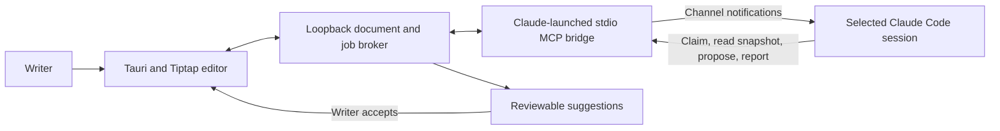

# Notebook Duplex: conversation background and handover

Prepared October 2, 2026 for someone taking over this prototype.

This captures the full scope, requests, decisions, implementation status, and outstanding work from the conversation available at handover. It is a consolidated conversation record, not a verbatim transcript of every assistant response or tool output. Earlier implementation turns were retained as summarized history; do not represent this file as an exact transcript.

## The original ask

Andrew wanted a simple Tauri Markdown editor with a WYSIWYG menu bar, table management, and a seamless document-first collaboration experience. The editor should expose an MCP server supporting channels so a local Claude Code session can process commands while Andrew continues writing.

Commands should include `/agent` followed by a request and inline `[tk: ...]` directives. Claude should also be able to proofread in the background. Changes should arrive as suggestions that Andrew approves, rather than directly replacing his writing. Stable cells or CRDT-like identities were proposed to prevent concurrent edits from breaking suggestions.

Andrew specifically preferred connecting an existing Claude conversation in the correct repository, with its existing tools and context, over starting a separate context-free agent. The desired experience should hide most of the agent's asynchronous nature and keep attention on the document.

The initial request included verifying the architecture and the MCP channels approach before building. Andrew then authorized a prototype and asked for the public Datadog DRUIDS style guide and Datadog notebook web appearance to inform its design. He explicitly prohibited Chrome use.

## Conversation requests, in order

1. Create a simple Tauri Markdown WYSIWYG editor with tables, MCP channels, inline commands, proofreading, and approval-based agent suggestions; verify the architecture and what is possible.
2. Prefer connecting an existing Claude session in its intended repository with the right tools.
3. Start building a prototype.
4. Find DRUIDS and Datadog notebook UI references and mimic what is possible.
5. Do not use Chrome.
6. Deliver the prototype ("gimme").
7. Explain how to connect a Claude session.
8. Diagnose why nothing was reaching the agent.
9. Andrew reported that his organization had disabled channels.
10. Investigate whether a separate Claude installation/directory could use his personal account.
11. Publish to `git@github.com:andyjmorgan/notebook-duplex.git` and prepare a personal-account demo that could encourage organizational approval for channels.
12. Capture the conversation and entire ask in `background.md` for handover.

## Published project and verified state

Repository: https://github.com/andyjmorgan/notebook-duplex

Published branch: `main`.

Published implementation commit: `813767eea1195b78629abbe79685d5313b1e0d33`.

Successful GitHub checks: https://github.com/andyjmorgan/notebook-duplex/actions/runs/36983723115

Local checkout at handover: `/Users/andrew.morgan/Documents/Codex/2026-09-30/i-w/outputs/editor-prototype`.

The working tree was clean after publication, before adding this handover file. No pull request was created. This handover file was created subsequently; its creation alone does not mean it has been committed or pushed.

The product and MCP server are named Notebook Duplex. Some internal identifiers retain the original prototype name, Margin: the Rust crate/binary is `margin-editor`, and the session display-name variable is `MARGIN_SESSION_NAME`.

All 13 automated tests, the web production build, and the Tauri custom-protocol compile check passed. These checks do not prove that a personal Claude account has authenticated or produced live model suggestions.

## Implemented architecture



The frontend uses TypeScript, Vite, Tiptap StarterKit, TableKit, UniqueID, and Markdown support. Tauri v2 provides the Rust desktop shell. A Node broker manages the document, jobs, snapshots, sessions, and proposals.

Tiptap JSON is the canonical document; Markdown is an import/export format. Stable paragraph and heading IDs plus content hashes identify proposal targets. This is a single-writer prototype, not a CRDT implementation.

The editor submits a job against a selected session. The bridge sends a `notifications/claude/channel` event to Claude. Claude uses MCP tools to claim the job, read its immutable snapshot, propose replacements, and report status. The tools are `claim_job`, `get_document_snapshot`, `propose_changes`, and `report_job_status`.

Suggestions remain separate from canonical text. Acceptance happens in the editor: the broker checks that the target still exists and matches its expected revision, and the frontend applies an undoable transaction. Editing another paragraph does not invalidate a suggestion. Editing or deleting its target does. The agent has no MCP acceptance tool.

This boundary prevents accidental application through the provided tools. It does not prevent a local agent with unrestricted filesystem access from editing runtime files directly; stronger isolation needs harness file-write restrictions.

The broker binds to loopback, checks browser origins, and requires a random bearer token. Bridge sessions have individual secrets. Documents and connection state persist under ignored `.runtime/` files, including `state.json` and `connection.json`.

## Implemented editor experience

- Basic rich text formatting, Markdown import/export, and GFM text tables.
- Table row, column, and header controls.
- Stable document node IDs and an automatic outline.
- Editing and Viewing modes.
- Slash insertion menu and explicit agent command submission.
- Named connected Claude sessions and session selection.
- Persisted jobs and reviewable proposals with accept, reject, locate, stale detection, and undo.
- Experimental proofreading of settled paragraphs, with obsolete proofreading jobs superseded.
- A local test-suggestion fixture for testing approval without a model.

Inline `[tk: ...]` directives require explicit submission through Run directive. They are not automatically executed just because the text exists. The original aspiration was seamless `/agent` and inline-command collaboration; the current implementation uses explicit submission and must not be described as a fully autonomous live-document agent.

Agent proposals currently replace one plain-text paragraph or heading. Formatted targets and structural table changes are refused. Tables are editable by the writer, but agent table-management proposals are not implemented.

## Existing Claude sessions and channel constraints

The MCP bridge is launched by Claude as a stdio server. The editor itself does not remotely attach channel support to an arbitrary already-running Claude process.

An existing conversation can be continued or resumed, but its Claude process must launch with channel support enabled. In a chosen repository, register the absolute bridge path:

```sh
claude mcp add --transport stdio --scope local notebook-duplex -- node "/absolute/path/to/notebook-duplex/agent/bridge.mjs"
claude --dangerously-load-development-channels server:notebook-duplex
```

Add `--continue` or `--resume` when appropriate. The bridge shows the working directory in the editor, allowing the writer to verify the chosen repository and select the intended session.

A running session and launch-time channel opt-in are required. Notifications may wait while Claude is busy. Receiving or sending a notification is not proof of model processing: job claiming is the acknowledgement.

Andrew's work organization disables channels. A working MCP tool connection does not imply that channel notifications are allowed. The development-channel launch flag does not override organization policy. No organization settings were changed or bypassed.

Restarting Claude currently creates a new bridge session identity. Pending jobs assigned to the old identity need cancellation and resubmission. Reconnects may replay notifications, and arbitrary external actions do not have exactly-once guarantees.

## Personal-account demo setup

A second Claude installation is not necessary to separate the login. The provided launcher uses a separate `CLAUDE_CONFIG_DIR` in `.personal-claude/` inside this checkout. That directory is ignored by Git.

The personal MCP registration has already been completed with:

```sh
npm run claude:personal -- --register-only
```

Personal authentication has not been completed. Andrew must sign in interactively with his personal account. A real personal-session model response remains unverified.

From the checkout, start the editor:

```sh
npm ci
npm start
```

Keep that terminal running. In another terminal:

```sh
npm run claude:personal -- --login
npm run claude:personal
```

Complete the personal claude.ai login, then accept Claude's development-channel warning and normal trust/tool prompts. Select “Personal demo” in the editor.

To continue the personal conversation later:

```sh
npm run claude:personal -- --continue
```

The launcher runs Claude in this public prototype repository. It clears inherited provider credentials and routing variables in its child process, including `ANTHROPIC_API_KEY`, `ANTHROPIC_AUTH_TOKEN`, `ANTHROPIC_BASE_URL`, `ANTHROPIC_PROFILE`, `CLAUDE_CODE_OAUTH_TOKEN`, and Bedrock/Vertex/Foundry selector variables. It preserves managed settings and restriction controls. Tests check this isolation.

A personal configuration directory does not remove device-wide managed policies. If those also prohibit channels, use an approved personal environment or obtain policy approval. The intended demonstration uses synthetic/public documents, not company code or documents transferred into a personal account.

## Suggested demo

1. Start the editor and personal Claude session; verify that “Personal demo” appears.
2. Import `examples/demo.md` or use the starter document.
3. Select a plain-text paragraph and ask: “Suggest a clearer version of this paragraph. Preserve its meaning.”
4. Verify the job is claimed and a proposal arrives.
5. Keep writing in another paragraph, then accept the proposal and confirm unrelated writing survives.
6. Submit another request, edit its target before accepting, and confirm the suggestion becomes stale.
7. Undo an accepted proposal.
8. Add a table through `/table` and exercise row/column controls.
9. Submit a `[tk: ...]` paragraph using Run directive.
10. Optionally enable experimental proofreading.

“Try a local test suggestion” exercises approval without calling a model. Do not present that fixture as a live agent response.

## Visual design

The UI uses independent components inspired by public DRUIDS foundations and official Datadog notebook screenshots. It does not import Datadog's internal component library.

The design uses a white document, title and metadata, compact formatting toolbar, outline on the left, and agent suggestions on the right. Bundled fonts are Noto Sans 400/600 and Roboto Mono 400. Public tokens informed the purple brand (`#632ca6`), blue primary action (`#006bc2`), and neutral border (`#e2e5ed`).

Chrome was not used for visual QA. Earlier discovery attempted to obtain browser access but did not receive it. Reference images were inspected locally. Native visual QA remains incomplete; compilation and DOM tests are not substitutes for it.

## Known gaps and tradeoffs

- One persisted document; no simultaneous writers or CRDT synchronization.
- Whole plain-text paragraph/heading replacement only; no formatted-range or table-structure proposals.
- No production packaging, native file dialogs, or complete external-file merging.
- Markdown import can normalize source. Obsidian frontmatter, wikilinks, rich HTML, and exact round trips are not certified.
- Tool permissions and trust prompts remain in Claude's terminal; the editor has no permission relay.
- Cancellation invalidates late proposals but does not interrupt Claude's agent loop.
- Background proofreading shares Claude's queue and can wait behind longer commands.
- Stale suggestions require another request rather than automatic rebasing.
- The desktop shell reads the broker descriptor from its source checkout.
- Runtime state and personal auth are excluded from Git; publication is source-only.

Stable IDs and immutable snapshots make approval safe for this limited single-writer case without the complexity of a CRDT. A future CRDT would help multiple writers and position tracking, but it would not eliminate the need to validate suggestion intent and conflicts.

## Verification and important files

```sh
npm test
npm run build
cargo check --manifest-path src-tauri/Cargo.toml --features custom-protocol
```

The tests cover MCP channel delivery with a mock client, proposal approval, session ownership, immutable snapshots, concurrent unrelated edits, cancellation, stale targets, editor rendering, undo, Viewing mode, slash-table insertion, and personal-profile isolation.

Read `README.md` first for setup and limitations. Frontend code is under `src/`; broker, bridge, store, launcher, and tests are under `agent/`; native shell configuration is under `src-tauri/`. `examples/demo.md` provides synthetic demo content. `.github/workflows/checks.yml` verifies tests and web build.

Ignored paths include `node_modules/`, `dist/`, `.runtime/`, `.personal-claude/`, `.env` variants, logs, Rust build output, and generated schemas. The published source was checked for local absolute paths and credential-like material before pushing.

## Next handover task

Complete the interactive personal login and verify an actual Claude proposal from editor submission through approval. If nothing arrives, inspect channel eligibility and the selected session first, then distinguish notification delivery from job claiming. Do not claim end-to-end success until the model has claimed a real job and returned a proposal.

After that, evaluate native UI behavior and demo polish. Further implementation should preserve the document-first experience and explicit approval boundary. The original vision remains broader than the current prototype, particularly formatted suggestions, robust reconnects, and seamless command/proofreading behavior.

## Andrew's working preferences

Keep explanations concise but include why and tradeoffs. Use C# anchors when explaining unfamiliar Go/Python code, not for architectural decisions. Avoid unnecessary code comments. Do not use Chrome. Obsidian is his primary knowledge store; the architecture and publication record are also in `Projects/Markdown Editor/Markdown editor with local agents.md` in his vault.

Never create a pull request or move one out of draft without Andrew's explicit review and consent. If authorized, create a draft first. Use full pull-request URLs. Publishing this repository was explicitly authorized; no PR was opened.

## Reference sources

- Claude channels: https://code.claude.com/docs/en/channels
- Channel contract: https://code.claude.com/docs/en/channels-reference
- Multiple accounts: https://code.claude.com/docs/en/authentication#log-in-with-multiple-accounts
- Environment variables: https://code.claude.com/docs/en/env-vars
- Managed settings: https://code.claude.com/docs/en/settings
- Public DRUIDS typography: https://druids.datadoghq.com/foundations/typography
- Datadog notebook appearance: https://www.datadoghq.com/blog/collaborative-notebooks-datadog/
- Notebook documentation: https://docs.datadoghq.com/notebooks/
